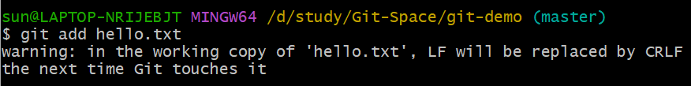
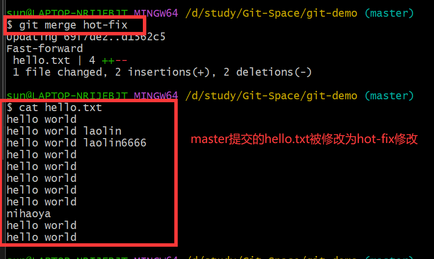
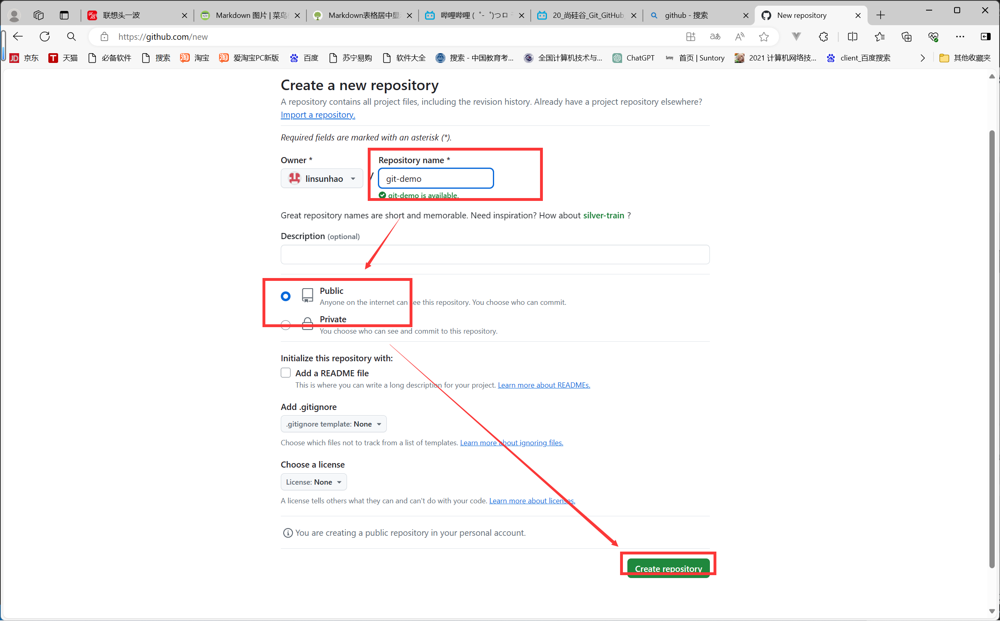
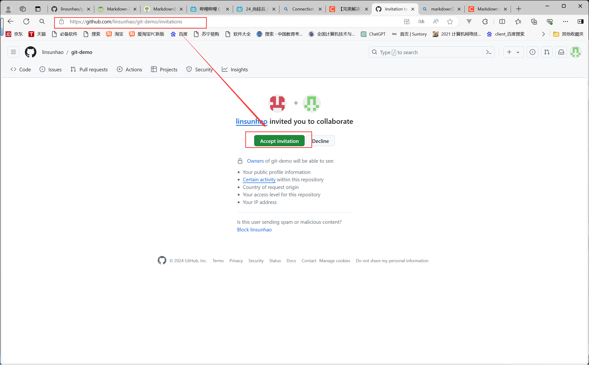
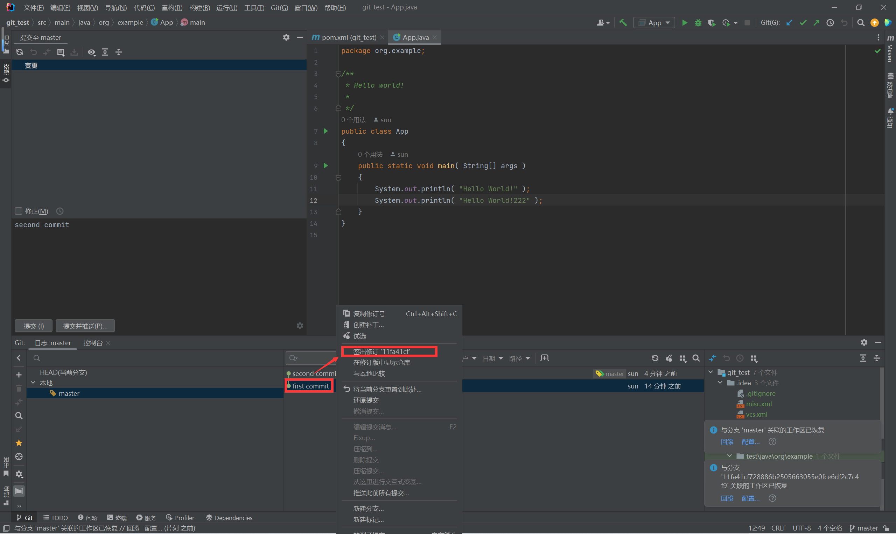
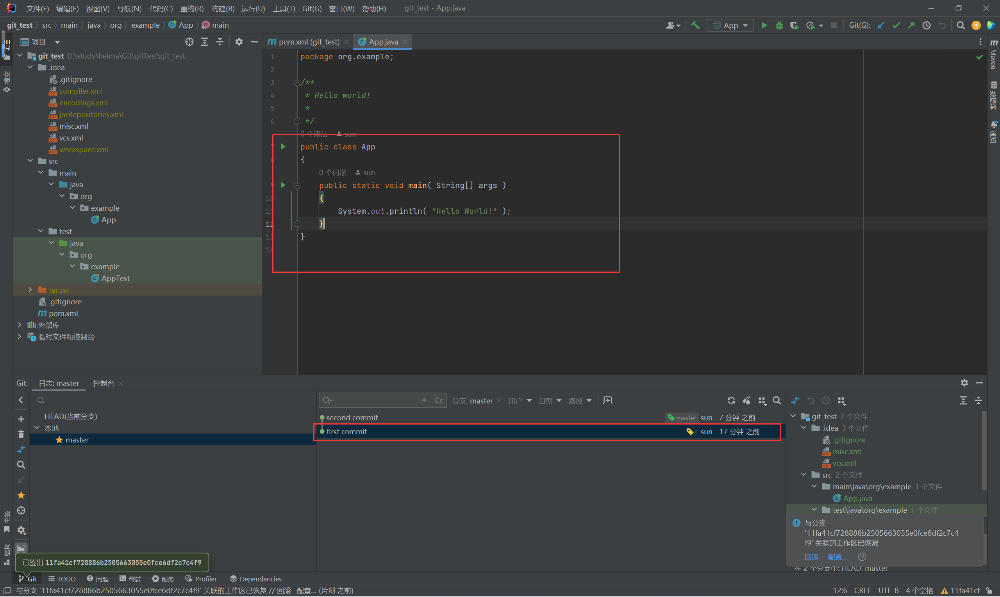
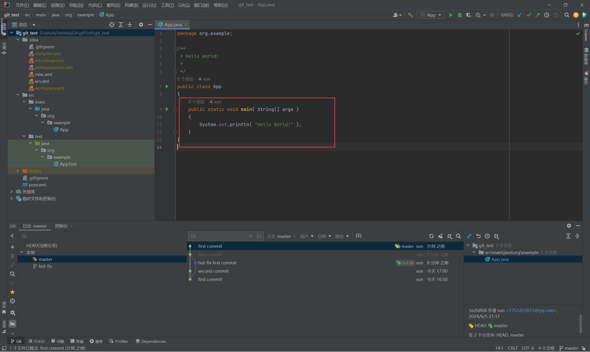
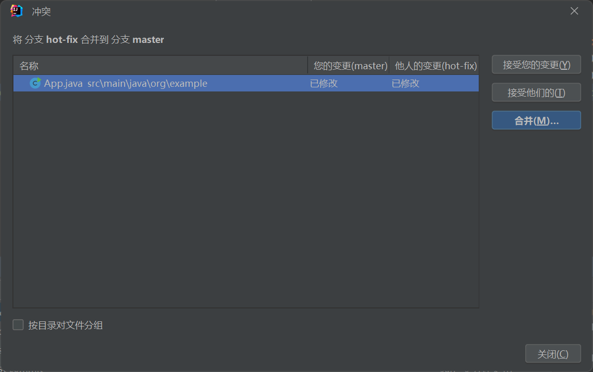
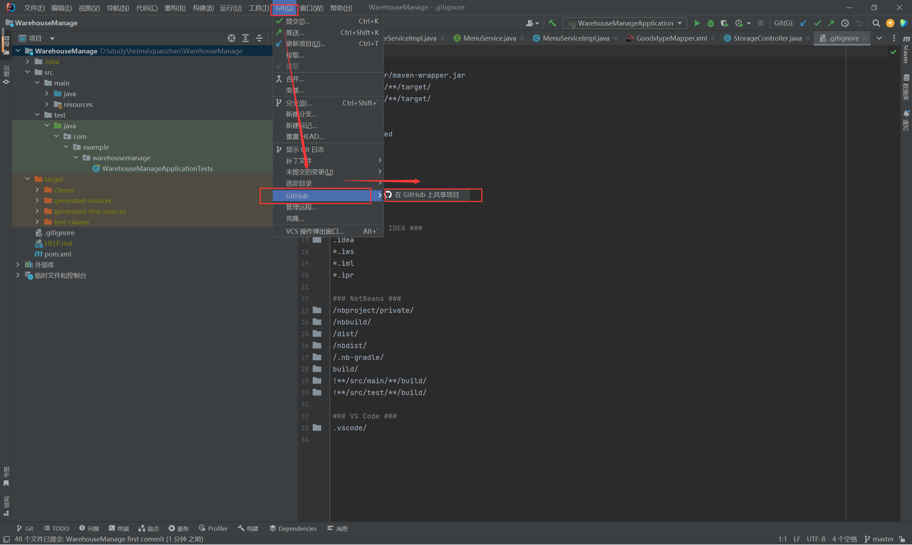

#   1.Git入门
###   1.1.Git常用命令
| 命令名称  |   作用    |
| ---- | ---- |
|git config --golbal user.name 用户名|设置用户签名|
|git config --global user.email 邮箱|设置用户签名|
|**git init**|初始化本地库|
|**git status**|查看本地库状态|
|**git add 文件名**|添加到缓存区|
|**git commit -m "日志信息" 文件名**|提交到本地库|
|**git reflog**|查看历史记录|
|**git reset --hard 版本号**|版本穿梭|  

*   git init的使用
    >   假设git-demo为项目文件夹，则需要先初始化git本地库，具体如下图所示。
    >     
    >
    >   初始得到的.git文件夹（不要擅自修改）
    >   

*   git status的使用
    >   主要查看当前本地库状态，具体如下图所示。
    >   

*   git add的使用
    >   添加文件到缓冲区，具体如下图所示。
    >   1.添加一个名为hello.txt的演示文件（添加过程与Linux一样）
    >   
    >
    >   2.添加一个名为hello.txt的演示文件
    >   
    >
    >   3.将hello.txt添加到缓存区中
    >   
    >
    >   4.git status查看缓存区,缓存区中出现hello.txt
    >   
    >
    >   5.通过 git rm --cached <文件名> 来删除缓存区中的文件（缓存区中的文件被删除后文件名会变红） 
    >
    >   **6.注：每一次切换分支后，文件夹中的文件就会变成该分支的本地库中的文件。**

*   git commit的使用
    >   将缓存区中的文件提交到本地库中，具体如下图所示。
    >   1.提交缓存区中的hello.txt文件(日志为 first commit)
    >   
    >
    >   2.通过git reflog查看历史信息,发现出现提交的历史信息
    >   
    >
    >   3.通过git log还可查看提交的用户信息与提交日期
    >   

###   1.2.修改文件
* 修改hello.txt文件
     
---
* 再次查看状态，发现提示被修改过，且爆红
    
---
* 此时需要再次使用git add将修改后的文件重新添加到缓存区中并通过git commit重新提交
  
  
---
* 查看日志与状态，添加成功
  
    

###   1.3.版本穿梭
* 需要查看指定历史版本的文件，则使用git reflog· 实现，如下图所示
     
---
* 使用命令改变HEAD指针指向指定版本并查看（HEAD指向master分支，而master分支指向当前选中的文件，通过命令修改后master直线对应版本的文件）
    
   
---
* 再次查看hello.txt，发现变回最初版本（第一行末尾没有一堆2）
     
* **注：版本穿梭是穿梭到指定版本的本地库，并将文件夹中的文件改为该版本本地库的文件。**

###   1.4.Git分支操作
* 什么是分支？
     
  注：其实分支就是在不影响主线的情况下进行的分支开发，分支提交的各版本代码不会影响主线（master），在分支开发测试完成后可以将分支代码合并到主线（master）中。如下图所示（hot-fix为分支，master为主线）
  
  主线文件
  
  分支文件
  
---
* 分支的好处
   
---
* 分支操作

| 命令名称  |   作用    |
| ---- | ---- |
|git branch 分支名|创建分支|
|git branch -v|查看分支|
|git checkout 分支名|切换分支|
|git merge 分支名|把指定的分支合并到当前分支上|

  > * git branch -v 查看分支
    
   
  > * git branch <分支名> 创建新分支
    
   
  > * git checkout <分支名> 切换分支
    
   
  > * git checkout <分支名> 切换分支
    
   
   
  > * 通过hot-fix分支修改hello.txt
  
   
  > * 将修改后的文件添加到缓存区中
  
   
  > * 切换回master分支，发现hello.txt为之前master分支提交的结果。
  
   
  > * 现将两分支进行合并（将hot-fix合并到master分支上）。
  

---
* 分支合并冲突
  > * 为什么会产生合并冲突？（注：合并是合并本地库的内容）
  
   
  > * master分支修改并提交hello.txt如下
  
   
  > * hot-fix分支修改并提交hello.txt（倒数第二行无后缀，倒数第一行有‘hot-fix test’后缀）
   
  > * 将hot-fix合并到master上出现如下提示，告知需要人工决定如何覆盖
  
   
  修改hello.txt冲突区域如下所示（最后两行为冲突区域）
    
   
  修改hello.txt冲突区域如下所示（最后两行为冲突区域）
  
   
  个人需要保留两个后缀则只需将冲突部分与标记符号去除即可(左为修改前，由为修改后)
  
   
  将修改结果进行提交并查看（注意提交时不要带有文件名，因为两个分支都修改了该文件，故系统不知道需要提交谁修改的文件）
    

##  2、Github远程仓库操作
###   2.1.Git团队协作机制
  > * ***队内协作***（push将本地库代码文件推送到远程仓库；clone是在本地库无代码文件的情况下从远程库中复制代码文件到本地库；pull是在本地库有代码文件的情况下拉取远程库的代码文件更新本地库代码文件）
  

  > * ***跨团队协作***（fork可以将某个远程库的代码文件复制到另一个远程库中；pull request发送拉取请求，通知其他远程库拉取合并本远程库的代码文件；merge进行远程库代码文件的合并）
  

###   2.2.创建github远程仓库
  > * 首先登陆github账号，点击左上角的加号，并选中“New repository”
  
  输入仓库名称（最好与本地库名称相同）并选择公共库，具体如下图所示
  
  创建成功后会看到有一段https协议的链接，这就是该远程库的访问链接，如果嫌链接太长可以通过 git remote add <别名> <远程链接地址> 来为该链接添加别名，并通过 git remote -v 查看所有别名。以下为该地址创建别名（别名最好与远程仓库名一致）
  

###   2.3.远程仓库操作
  

| 命令名称  |   作用    |
| ---- | ---- |
|git remote -v|查看所有别名|
|git remote add <别名> <远程链接>|创建别名|
|***git push <别名> <分支>***|将指定分支上的内容推送到远程仓库|
|***git pull <别名> <分支>***|把远程仓库的内容拉取并更新到分支中|
|***git clone <别名>***|从远程仓库克隆代码文件|

  > * 使用 git push 将master分支的内容推送到远程仓库
  
  查看仓库，有hello.txt文件，推送成功
  
   

  > * 使用 git pull 将远程仓库的内容拉取到当前分支
  修改远程仓库的文件
  
  将修改后的文件拉取过来
  
  仓库拉取过来的文件，发现是修改后的文件，拉取成功
  
   

  > * 使用 git clone 从远程仓库克隆文件
  创建一个空文件夹another模拟需要获取文件的用户文件夹
  
  打开命令行，输入命令进行克隆（还未创建别名，故使用https链接）
  
  
  克隆会做如下操作：
      1.拉取代码
      2.初始化本地仓库（与远程仓库同名）
      
      3.创建别名
      
   

  > * 其他成员使用 git pull 将文件推送到远程库
  打开远程库设置，将参与成员添加进来
  
  点击“添加人员”
  
  输入成员名并选择添加
  
  克隆邀请码
  
  模拟登陆另一个成员并在地址栏输入邀请码，点击接受邀请
  
  接受邀请后该成员就有向远程仓库推送文件的权限了（注意！如果没有加入团队只能拉取文件，不能推送文件）
  编辑hello.txt文件
  
  将文件提交到本地仓库
  
  将修改后的文件推送到远程仓库
  
  打开远程仓库文件，发现已修改，推送成功
  
  从远程仓库拉取文件，更新成功
  
   

##  3、IDEA集成Git  
###   3.1.配置Git忽略文件
  > 1、忽略什么文件？
    
   

  > 2、为什么忽略？
  
   

  > 3、怎么忽略？（注意，IDEA创建Spring项目时会自动生成忽略文件 .gitignore）
  （1）
  （2）

###   3.2.IDEA定位Git程序
  > * 进入设置配置，具体步骤如下图所示。
  

###   3.3.初始化项目本地库
  > * 在创建项目时点击“创建Git仓库”。
  
  打开项目文件夹可以发现git本地库已创建。
  
  也可以点击上方的“VCS”并选择“创建Git仓库”，具体如下图所示
  
  打开项目文件夹可以发现git本地库已创建。
  
  如果创建了Git本地仓库后IDEA代码文件报红，说明本地仓库创建成功，只是项目中的代码文件还没有被追踪（未存入暂存区）
  

###   3.4.添加到本地库 
  > * 如何将代码文件加入暂存区？（两种方法）
    >> 1、右键点击未加入暂存区的文件，选中“Git”并点击“Add”
    
    添加后文件变绿，表示添加成功
      
    有时创建文件时IDEA会自动询问是否添加文件到本地库中
     
     
    >> 2、如果需要添加的文件数量多，则上面的方法就不适用了，可以选中项目文件并将整个项目文件都添加到暂存区中。
     
    添加后全变绿，添加成功（如果有的文件为黄色，则说明其被忽略）
    
    添加成功后即可将项目提交到本地库中，步骤如下
    
    提交后的文件颜色会回归正常

###   3.5.切换版本
  > * 修改提交后的文件，文件变蓝，表明提交的文件被修改
  
  将修改后文件的也提交，项目出现了两种不同版本
  想要查看版本信息可以点击IDEA左下角的“Git”即可看到所有版本与分支。
  
  指针如下（绿色为HEAD指针，黄色为master指针）
  
  如果需要切换版本，那么只需要右键对应的版本并点击“签出”即可，以下为两个版本的切换。
  第二版本
  
  点击“签出”
  
  变回第一版本
  

###   3.5.分支创建与切换
  > * 想要新建分支可以点击右下角下图所示区域
  
  点击“新建分支”
  
  起名
  
  在创建后即可发现多出了一个分支（右下角可以查看当前分支）
  
  如下过程来切换分支
  

###   3.6.分支合并
  > * 正常合并
  首先切换到hot-fix分支修改代码并提交
  
  切换回master，查看master分支的代码
  
  将hot-fix分支合并到master上，步骤如下
  

  > * 合并冲突
  首先切换到hot-fix分支修改代码并提交
  
  切换回master，查看master分支的代码
  
  将hot-fix分支合并到master上，发现冲突
  
  点击合并开始人工合并（**此处的冲突为是像hot-fix一样无15行，还是像master要15行**）
  
  我们选中保留15行，合并成功
  

###   3.7.设置Github账号
  > * 按下图步骤进行Github账号添加与登陆
  
  > * 绑定账号（如果账号登陆不行，则可以使用token口令登陆，具体步骤上网搜寻）
  

###   3.8.将项目推送分享到Github
  > * 按下图步骤将项目分享到Github上
  
  输入并选择远程仓库的名称、访问权限、别名（remote）等信息
  
  点击“共享”后查看是否创建该项目的远程仓库（可能需要等待一段时间）
  
  出现对应的远程仓库，分享成功
  

###   3.9.推送与拉取、克隆
  > **推送**
  >> * 首先为项目多添加一个文件并提交到本地库
  
  按下图推送本地库中的文件
  
  查看推送的本地库与其中的内容，点右下角的“推送”
  
  提示推送成功
  
  查看远程仓库，发现新添加的文件出现，推送成功
  
      

  > **拉取**
  **注：在我们进行代码编写前做好先看一看当前本地的代码版本是否落后于远程仓库，如果落后了就需要拉取最新版本的，避免由于本地版本低导致push请求被拒绝**
  
  >> * 首先在github网页修改README文件，来模拟远程仓库文件被修改为最新之后进行拉取。
  
  按下图从远程仓库拉取代码文件
  
  拉取成功后查看文件是否为最新版本，发现文件被修改，拉取成功。
  
   

  > **克隆**
  >> * 在项目创建主页面中点击“VCS”，选择“仓库URL”克隆文件，也可以直接选择“Github”选择用户的远程库进行克隆，这里以“仓库URL”为例。
  复制远程仓库的https链接并输入
  
  点击克隆后稍等片刻，查看克隆是否完成，发现在指定文件夹创建了克隆项目，克隆成功
  
  ***甚至不许要配置就看直接运行，牛***
  
